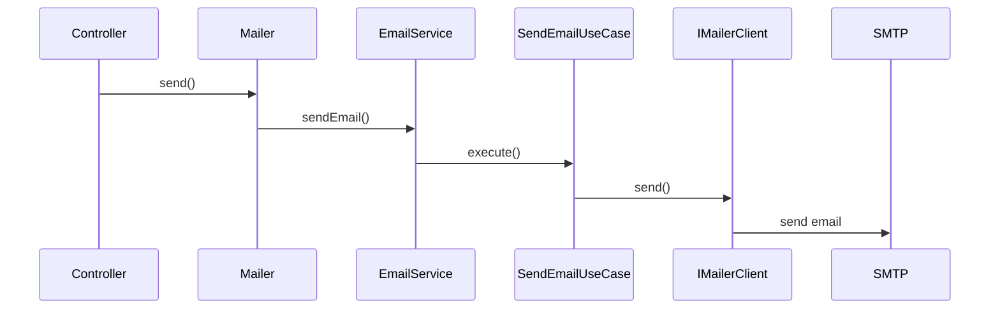
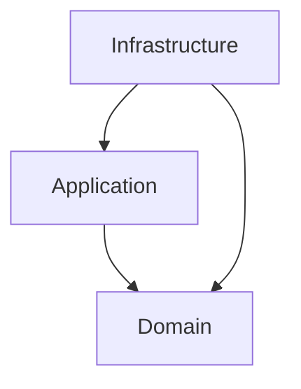

# @jmlq/mailer — Architecture 🏛️

## 🎯 Objective

Define a decoupled architecture for sending emails.

---

## ⭐ Importance

Allows changing the email provider without modifying business logic.

---

# 🧱 Main components

## Mailer (facade)

Public interface for sending emails.

```
mailer.send()
mailer.sendBatch()
```

---

## EmailService

Orchestrates email sending using use cases.

---

## SendEmailUseCase

Main use case that:

- validates the email
- processes templates
- delegates to the provider

---

## IMailerClient

Port that must be implemented by any provider.

---

## NodemailerService

Concrete implementation of the port using Nodemailer.

---

# 🔁 Sending flow



---

# 🧩 Clean Architecture



---

## ✅ Checklist

- [create SMTP provider](./configuration.md#create-transporter)
- [create mailer instance](./configuration.md#create-mailer-instance)
- [use mailer in the application](./configuration.md#implementation-with-nodemailer)

---

## ⬅️ Previous

- [`home`](../../README.md)

## ➡️ Next

- [Configuration](./configuration.md)
- [Express Integration](./integration-express.md)
- [Troubleshooting](./troubleshooting.md)
