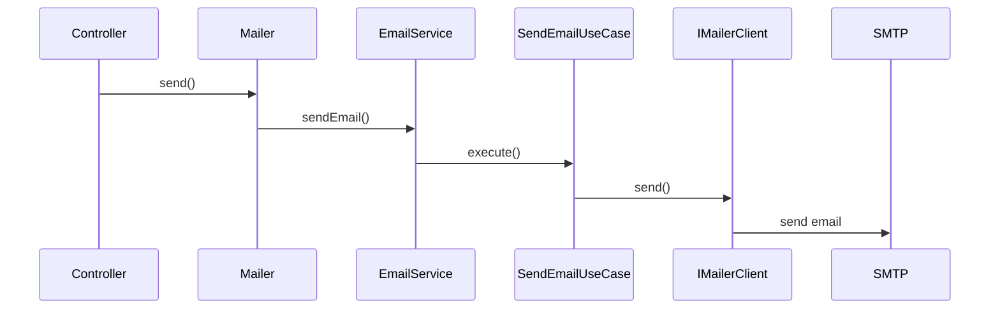
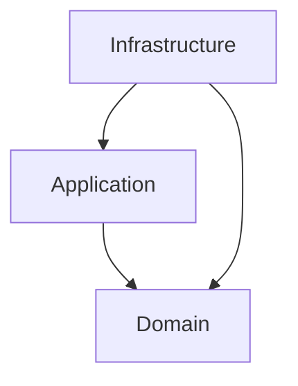

# @jmlq/mailer — Architecture 🏛️

## 🎯 Objetivo

Definir una arquitectura desacoplada para el envío de correos electrónicos.

---

## ⭐ Importancia

Permite cambiar el proveedor de correo sin modificar la lógica de negocio.

---

# 🧱 Componentes principales

## Mailer (facade)

Interfaz pública para enviar correos.

```
mailer.send()
mailer.sendBatch()
```

---

## EmailService

Orquesta el envío de correos usando los casos de uso.

---

## SendEmailUseCase

Caso de uso principal que:

- valida el email
- procesa templates
- delega al proveedor

---

## IMailerClient

Puerto que debe implementar cualquier proveedor.

---

## NodemailerService

Implementación concreta del puerto usando Nodemailer.

---

# 🔁 Flujo de envío



---

# 🧩 Clean Architecture



---

## ✅ Checklist

- [crear proveedor SMTP](./configuration.md#crear-transporter)
- [crear instancia de mailer](./configuration.md#crear-instancia-del-mailer)
- [usar mailer en la aplicación](./configuration.md#implementación-con-nodemailer)

---

## ⬅️ Anterior

- [`inicio`](../../README.es.md)

## ➡️ Siguiente

- [Configuración](./configuration.md)
- [Integración Express](./integration-express.md)
- [Troubleshooting](./troubleshooting.md)
